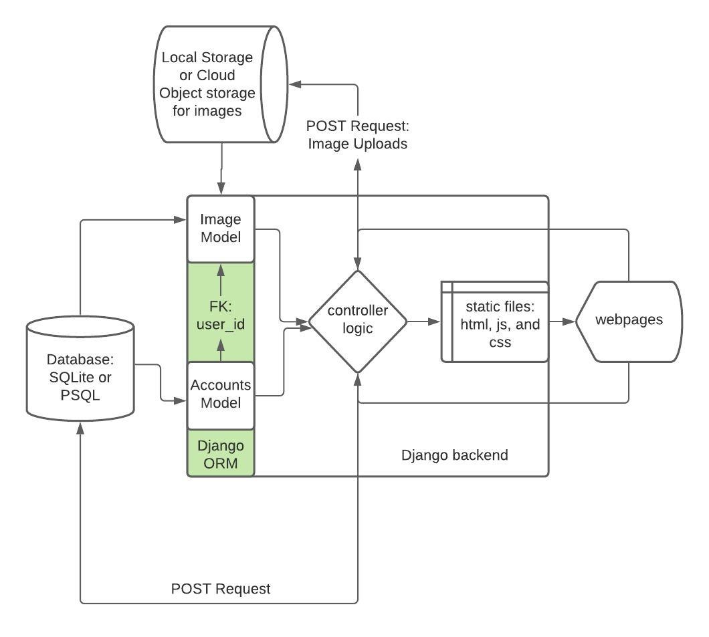

# Shopify Back-End Intern Challenge

### Demo Video:

[https://www.loom.com/share/71d988e7efb04e758164be870b9ece67](https://www.loom.com/share/71d988e7efb04e758164be870b9ece67)

### Rudimentary **System Diagram:**



### To run the project locally:

```bash
git clone [https://github.com/alswang18/imageRepository.git](https://github.com/alswang18/imageRepository.git)
cd imageRepository

#make sure you have pipenv or you can pip install pipenv
pipenv install

pipenv run python manage.py makemigrations
pipenv run python manage.py migrate
pipenv run python manage.py collectstatic

pipenv run python manage.py createsuperuser

#Option 1
#to run locally just run the following
pipenv run python manage.py runserver
#Option 2
#to run on docker do the following
docker build -t django-image-repo -f Dockerfilemage-repo -f Dockerfile .
docker run -it -p 8888:8mage-repo -f Dockerfile888 django-image-repo

#Go to localhost:8888
#There is currently a problem loading static assets in the docker version.
#You can likely as easily 
```

### **Things That Still Bother Me:**

- Make the datetime system more robust for users from different timezones to interact.
- Fix the Docker container interactions to properly load static files.

### Top of Mind **Feature Roadmap:**

- Save a copyrighted version of each of the files to load if the image is copyrighted. Implementation for watermark function has been somewhat worked on as seen in the unintegrated watermark.py file.
- Implement JWT-based authentication instead of session-based authentication to allow for better scalability and compatibility with Frontend JS frameworks like React.
- Implement S3 object storage using the boto package instead of storing it locally.
